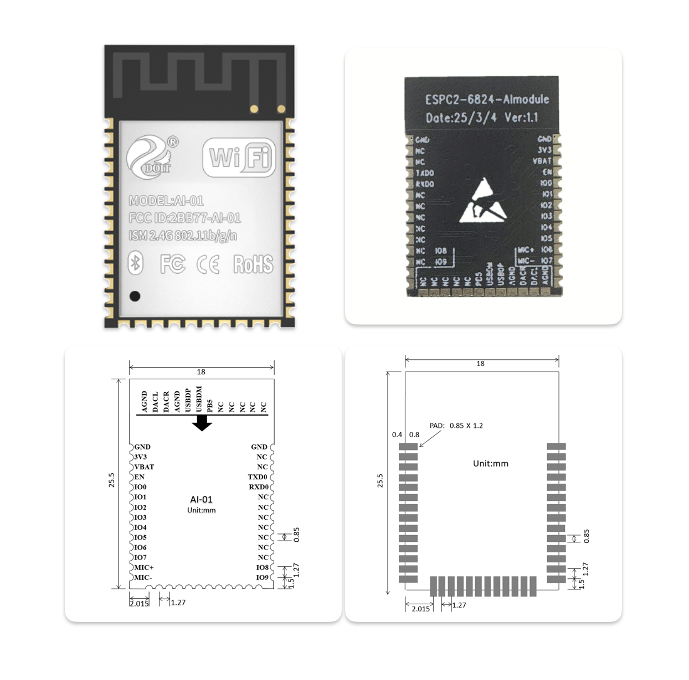
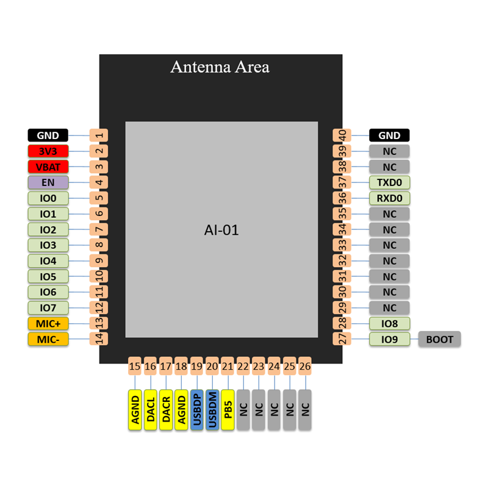

# ESP32-C3(C2)+VB6824 x 小智 AI 

- 首先致谢虾哥的开源项目：https://github.com/78/xiaozhi-esp32
- 其次致谢：https://github.com/xinnan-tech/xiaozhi-esp32-server

## 项目简介

👉 [视频介绍【bilibili】](https://www.bilibili.com/video/BV1icXPYVEMN/)

👉 [ESP32+SenseVoice+Qwen72B打造你的AI聊天伴侣！【bilibili】](https://www.bilibili.com/video/BV11msTenEH3/)

👉 [给小智装上 DeepSeek 的聪明大脑【bilibili】](https://www.bilibili.com/video/BV1GQP6eNEFG/)

👉 [AI-01模组使用手册](docs/AI-01_使用手册.pdf)


在线下载固件：https://xiaozhi.doit.am/

👉 [开发板生产资料](docs/开发板生产资料AI-01-DevKit-v1.1.zip)


特色：

1. VB6824 作为AI语音芯片负责语音打断唤醒和离线语音识别，同时负责录音+音频播放;ESP32-C3(C2)芯片负责接入在线大模型+CozyLife APP。
2. VB6824 UART TX输出降噪后的高信噪比的录音，接到ESP32-C3(C2)芯片UART RX，RX收到的数字音频发给在线大模型。
3. VB6824 从DAC处，做回声信号的采集，接入到PA0/PA1（LINEIN）作为AEC的回采信号。
4. VB6824 语音识别后把识别结果通过UART TX发给ESP32-C3(C2)芯片。


已实现功能

- Wi-Fi / ML307 Cat.1 4G
- BOOT 键唤醒和打断，支持点击和长按两种触发方式
- 离线语音唤醒 [ESP-SR](https://github.com/espressif/esp-sr)
- 流式语音对话（WebSocket 或 UDP 协议）
- 支持国语、粤语、英语、日语、韩语 5 种语言识别 [SenseVoice](https://github.com/FunAudioLLM/SenseVoice)
- 声纹识别，识别是谁在喊 AI 的名字 [3D Speaker](https://github.com/modelscope/3D-Speaker)
- 大模型 TTS（火山引擎 或 CosyVoice）
- 大模型 LLM（Qwen, DeepSeek, Doubao）
- 可配置的提示词和音色（自定义角色）
- 短期记忆，每轮对话后自我总结
- OLED / LCD 显示屏，显示信号强弱或对话内容
- 支持 LCD 显示图片表情
- 支持多语言（中文、英文）

## 软件部分
* ESP-IDF需要在5.3以上，推荐版本为5.3，参考[官方指南](https://docs.espressif.com/projects/esp-idf/zh_CN/latest/esp32c2/get-started/index.html)
* 编译
    ```
    idf.py @main/boards/doit-ai-01-kit/boards.cfg build    
    or
    idf.py set-target esp32c2
    idf.py menuconfig
    // Xiaozhi Assistant ---> Board Type ---> Doit-AI-01-Kit    
    idf.py build
    ```

### 下载说明
可使用[配套的下载器](https://item.taobao.com/item.htm?id=903237380382&skuId=5947883431059&spm=a1z10.5-c-s.w4002-21590874298.11.126342baEAq94S)或普通的TTL(USB转串口)
#### 接线指导

##### 下载器
| AI-01开发板     | 下载器 |
| --------- | -------- |
| TX        | RX       |
| RX        | TX       |
| IO9       | BOOT     |
| EN        | EN       |
| 5V        | 5V       |
| GND       | GND      |

##### 普通TTL
| AI-01开发板     | TTL(USB转串口) |
| --------- | -------- |
| TX        | RX       |
| RX        | TX       |
| 3V3       | 3V3      |
| GND       | GND      |

## 下载步骤
- 准备
    - 下载器
        1. 下载器接入电脑即可
    - 普通TTL
        1. AI-01开发板和TTL都断开电脑的连接
        2. 先按住AI-01开发板按键，再把TTL接入电脑，AI-01开发板USB口不要接
- 下载
    - 网页下载    
        1. 浏览器访问https://xiaozhi.doit.am, 并选择四博智联小智AI-01智能体    
        2. 点击烧录，进入烧录界面     
        3. 点击连接，选择弹窗的设备，点击连接    
        4. 点击烧录，等待烧录完成    
    - IDF下载    
        1. idf.py flash   

## 硬件部分






## 离线唤醒词
### 唤醒词
| 中文唤醒词           | 英文唤醒词         |
| ------------------ | ---------------- |
| 你好小智            |                  |
| 小艾小艾(需升级支持) | Hey Alice(需升级支持) |


### 机器人

| 中文指令           | 英文指令         |
| ------------------ | ---------------- |
| 再见/不聊了        | Peace out        |
| 站起来/站立        | Stand up         |
| 坐下               | Sit down         |
| 趴下               | Get down         |
| 转个圈             | Turn around      |
| 打个滚             | Roll over        |
| 去尿尿/尿尿去      | Go pee-pee       |
| 去睡觉/睡觉去      | Go to sleep      |
| 装死               | Play dead        |
| 秀一个/跳个舞/跳舞 | Show time        |
| 来个绝活           | Do stunts        |
| 倒立旋转           | Handstand spin   |
| 前进               | Move forward     |
| 后退               | Move backward    |
| 左转/向左转        | Turn left        |
| 右转/向右转        | Turn Right       |
| 过来               | Come here        |
| 走开/滚开/滚蛋     | Go away          |
| 匍匐前进           | Crawling forward |
| 滑步               | Sliding step     |
| 我讨厌你           | I hate you       |

### 灯光

| 中文指令 | 英文指令             |
| -------- | -------------------- |
| 打开灯光 | Turn On The Light    |
| 关闭灯光 | Switch Off The Light |
| 调亮灯光 | Brighten The Light   |
| 调暗灯光 | Dim The Light        |
| 七彩模式 | Colorful Mode        |
| 音乐模式 | Music Mode           |
| 白色灯光 | White Light          |
| 黄色灯光 | Yellow Light         |
| 自然灯光 | Natural Light        |
| 红色灯光 | Red Light            |
| 绿色灯光 | Green Light          |
| 蓝色灯光 | Blue Light           |
| 橙色灯光 | Orange Light         |
| 青色灯光 | Cyan Light           |
| 紫色灯光 | Purple Light         |
|||
### 音乐

| 中文指令 | 英文指令      |
| -------- | ------------- |
| 播放音乐 | Play music    |
| 暂停播放 | Pause playing |
| 停止播放 | Stop playing  |
| 上一首   | Previous song |
| 下一首   | Next song     |

### 配网

| 中文指令 | 英文指令      |
| -------- | ------------- |
| 开始配网 | Start pairing |
| 停止配网 | Stop pairing  |

## 更多问题

技术支持微信：andy433928

模组购买链接：https://item.taobao.com/item.htm?id=901004417223
开发板购买链接：https://item.taobao.com/item.htm?ft=t&id=903237380382
